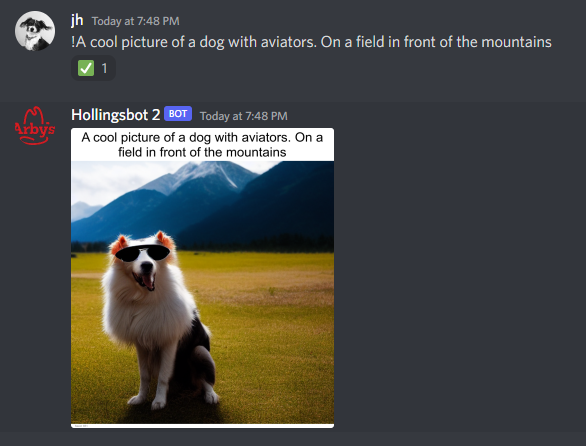

**This repo is a personal project that I'm using for fun, is a rough work in progress, and is not guaranteed to work. I
use this for my own personal server, and anything I push to the repo "works on my machine".**

**If you have any issues, message me on Discord `Hollings#6943` or Twitter `hollingsfsdf` and I'll do my best to help**

# discord-stable-diffusion (AKA Hollingsbot 2)

Hollingsbot 2 is a Discord bot that interfaces
with [AUTOMATIC1111's web UI](https://github.com/AUTOMATIC1111/stable-diffusion-webui) to generate Stable Diffusion
images on demand.

## Features

- Generate one or more Stable Diffusion images from a prompt in whitelisted discord channels
- Use modifiers in the Discord message to add tags to the prompt, generate more images, change steps, etc
- Automatic upscaling of generated images
- Generate text from an uploaded image using CLIP and GPT-3

## Install and Run

- Install [AUTOMATIC1111's web UI](https://github.com/AUTOMATIC1111/stable-diffusion-webui)
    - **Note** - the A1111 repo gets updated very frequently and new versions may break compatibility with this bot. The
      current commit that the bot has been tested on is `c8045c5ad4f99deb3a19add06e0457de1df62b05`
- Create and invite your discord bot to a server (https://discord.com/developers/applications/)
- **Optional** Create an OpenAI account and generate an API key (https://beta.openai.com/account/api-keys)
- Rename `.env.example` to `.env` and update values with the appropriate values
- Install dependencies with `pip install -r requirements.txt`
- Run `bot.py`

## Troubleshooting

### **Bot receives a prompt, but fails when attempting to generate**

- Downgrade Automatic1111 WebUI to the version specified in the install instructions. Every update to the WebUI has a
  high chance of breaking this script, and the frequency of updates is hard to keep up with.

### **Bot is not doing anything and not throwing any errors**

- Check that your bot has been invited to your server with enough permissions to read and send messages, images, and
  reactions.

- Check that your channel ID is added to the channel_config DB table.
